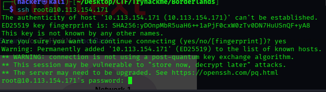

# H1 Borderlands Tryhackme

# H3 Nmap Scan
command : ```**sudo rustscan -a 10.113.154.171 -r 1-65535 --ulimit 5000 -- -A -oN nmap.txt**```

```
PORT   STATE SERVICE REASON         VERSION
22/tcp open  ssh     syn-ack ttl 62 OpenSSH 7.2p2 Ubuntu 4ubuntu2.8 (Ubuntu Linux; protocol 2.0)
| ssh-hostkey: 
|   2048 35:5f:cb:0c:e9:1d:cb:1f:12:5a:d8:2e:d3:f9:e3:81 (RSA)
| ssh-rsa AAAAB3NzaC1yc2EAAAADAQABAAABAQCXqgFyb7Z0czcGvpxDfEBkqh23B4HMt7vKutxSaFfcn1q8I6rwy6XBbcWPnjylpkBdc8222IW0YI4WEiWdAEqOJtP+psBEJO8nBwOKY6jCRRl3rq5i9rutUlWWZLr9XglpePWx2OAl3FbCtR+1jBdlo9sxiJKzcLUb5QToz++bo+6YR8F+yvF+QcTBiAz8SQM7VYkPfkRz171VEzSqZd5GIKziyFjsEtwae96iMSBdZzYPPiw7ASUJhVRCXFT8LSW/GEdHXr69lHEoqjl3Fy7aH8pAPh+g2y1NlQ9xJU7C88HF0tBGDzhFYDPNllOeWDSzJbf9qzF8K0ipb6d3op33
|   256 b1:90:32:88:d8:02:d1:0d:5f:9b:c3:63:04:d9:7d:2d (ECDSA)
| ecdsa-sha2-nistp256 AAAAE2VjZHNhLXNoYTItbmlzdHAyNTYAAAAIbmlzdHAyNTYAAABBBCKecjTwnewkRnZNYyqUueDqQlJsiLOxQksebWzvfOdlrDaRyaK3yWwnGFsh9M3mct/hPzYRbrqsq3HkPUBmxeQ=
|   256 39:2c:bb:26:d1:65:30:5f:97:df:25:07:8f:64:5c:57 (ED25519)
|_ssh-ed25519 AAAAC3NzaC1lZDI1NTE5AAAAIAheNWyq24PG6Hfoj84v/ap+GQBY+4LgDSgidmafz/A0
80/tcp open  http    syn-ack ttl 61 nginx 1.14.0 (Ubuntu)
| http-cookie-flags: 
|   /: 
|     PHPSESSID: 
|_      httponly flag not set
| http-git: 
|   10.113.154.171:80/.git/
|     Git repository found!
|     .git/config matched patterns 'user'
|     Repository description: Unnamed repository; edit this file 'description' to name the...
|_    Last commit message: added mobile apk for beta testing. 
| http-methods: 
|_  Supported Methods: GET HEAD POST
|_http-server-header: nginx/1.14.0 (Ubuntu)
|_http-title: Context Information Security - HackBack 2
Warning: OSScan results may be unreliable because we could not find at least 1 open and 1 closed port
OS fingerprint not ideal because: Missing a closed TCP port so results incomplete
Aggressive OS guesses: Linux 3.8 - 3.16 (91%), Linux 3.13 (90%), Linux 4.4 (90%), Linux 3.10 - 3.13 (87%), Linux 5.4 (87%), Crestron XPanel control system (86%), Linux 4.15 - 5.19 (86%), Android 10 - 12 (Linux 4.14 - 4.19) (85%), HP P2000 G3 NAS device (85%)
No exact OS matches for host (test conditions non-ideal).
TCP/IP fingerprint:
SCAN(V=7.98%E=4%D=4/15%OT=22%CT=%CU=%PV=Y%DS=3%DC=T%G=N%TM=69DF5FE0%P=x86_64-pc-linux-gnu)
SEQ(SP=105%GCD=1%ISR=10B%TI=Z%II=I%TS=8)
SEQ(SP=107%GCD=1%ISR=106%TI=Z%II=I%TS=8)
OPS(O1=M4E8ST11NW7%O2=M4E8ST11NW7%O3=M4E8NNT11NW7%O4=M4E8ST11NW7%O5=M4E8ST11NW7%O6=M4E8ST11)
WIN(W1=68DF%W2=68DF%W3=68DF%W4=68DF%W5=68DF%W6=68DF)
ECN(R=Y%DF=Y%TG=40%W=6903%O=M4E8NNSNW7%CC=Y%Q=)
T1(R=Y%DF=Y%TG=40%S=O%A=S+%F=AS%RD=0%Q=)
T2(R=N)
T3(R=N)
T4(R=Y%DF=Y%TG=40%W=0%S=A%A=Z%F=R%O=%RD=0%Q=)
U1(R=N)
IE(R=Y%DFI=N%TG=40%CD=S)

Uptime guess: 198.840 days (since Sun Sep 28 15:42:55 2025)
Network Distance: 3 hops
TCP Sequence Prediction: Difficulty=261 (Good luck!)
IP ID Sequence Generation: All zeros
Service Info: OS: Linux; CPE: cpe:/o:linux:linux_kernel

TRACEROUTE (using port 80/tcp)
HOP RTT       ADDRESS
1   344.42 ms 192.168.128.1
2   ...
3   344.46 ms 10.113.154.171

NSE: Script Post-scanning.
NSE: Starting runlevel 1 (of 3) scan.
Initiating NSE at 11:52
Completed NSE at 11:52, 0.00s elapsed
NSE: Starting runlevel 2 (of 3) scan.
Initiating NSE at 11:52
Completed NSE at 11:52, 0.00s elapsed
NSE: Starting runlevel 3 (of 3) scan.
Initiating NSE at 11:52
Completed NSE at 11:52, 0.00s elapsed
Read data files from: /usr/share/nmap
OS and Service detection performed. Please report any incorrect results at https://nmap.org/submit/ .
Nmap done: 1 IP address (1 host up) scanned in 25.11 seconds
           Raw packets sent: 86 (7.372KB) | Rcvd: 33 (5.701KB)

```

# H3 SSH
From Watching Tyler I've learnt to check if SSH is password based or Key based so i decided to check for it looks like its passwd based.



### H3 HTTP (80)
I checked HTTP


so far it looks like a poorly done website and there seems to be a login page i tried basic passwords, I also ran Caido a proxy tool on the background just to capture the communication between the server and the client(Me).


I Also ran **Nuclei** to get some low hanging fruits i found a few

```
└─$ nuclei -u http://10.113.154.171/              

                     __     _
   ____  __  _______/ /__  (_)
  / __ \/ / / / ___/ / _ \/ /
 / / / / /_/ / /__/ /  __/ /
/_/ /_/\__,_/\___/_/\___/_/   v3.7.1

                projectdiscovery.io

[INF] Your current nuclei-templates v10.4.0 are outdated. Latest is v10.4.1
[INF] Successfully updated nuclei-templates (v10.4.1) to /home/hacker/.local/nuclei-templates. GoodLuck!

Nuclei Templates v10.4.1 Changelog
┌───────┬───────┬──────────┬─────────┐
│ TOTAL │ ADDED │ MODIFIED │ REMOVED │
├───────┼───────┼──────────┼─────────┤
│ 3924  │ 77    │ 3846     │ 1       │
└───────┴───────┴──────────┴─────────┘
[WRN] Found 1 templates with runtime error (use -validate flag for further examination)
[INF] Current nuclei version: v3.7.1 (latest)
[INF] Current nuclei-templates version: v10.4.1 (latest)
[INF] New templates added in latest release: 76
[INF] Templates loaded for current scan: 9976
[WRN] Loading 17 unsigned templates for scan. Use with caution.
[INF] Executing 9959 signed templates from projectdiscovery/nuclei-templates
[INF] Targets loaded for current scan: 1
[INF] Templates clustered: 2260 (Reduced 2134 Requests)
[INF] Using Interactsh Server: oast.fun
[phpinfo-files] [http] [low] http://10.113.154.171//info.php ["7.2.19"] [paths="/info.php"]
[cookies-without-secure] [javascript] [info] 10.113.154.171 ["PHPSESSID"]
[cookies-without-httponly] [javascript] [info] 10.113.154.171 ["PHPSESSID"]
[waf-detect:nginxgeneric] [http] [info] http://10.113.154.171/
[CVE-2023-48795] [javascript] [medium] 10.113.154.171:22 ["Vulnerable to Terrapin"]
[ssh-auth-methods] [javascript] [info] 10.113.154.171:22 ["["publickey","password"]"]
[ssh-password-auth] [javascript] [info] 10.113.154.171:22
[ssh-server-enumeration] [javascript] [info] 10.113.154.171:22 ["SSH-2.0-OpenSSH_7.2p2 Ubuntu-4ubuntu2.8"]
[ssh-sha1-hmac-algo] [javascript] [info] 10.113.154.171:22
[openssh-detect] [tcp] [info] 10.113.154.171:22 ["SSH-2.0-OpenSSH_7.2p2 Ubuntu-4ubuntu2.8"]
[nginx-eol:version] [http] [info] http://10.113.154.171/ ["1.14.0"]
[nginx-version] [http] [info] http://10.113.154.171/ ["nginx/1.14.0"]
[php-detect] [http] [info] http://10.113.154.171/
[git-config] [http] [medium] http://10.113.154.171/.git/config
[http-missing-security-headers:strict-transport-security] [http] [info] http://10.113.154.171/
[http-missing-security-headers:content-security-policy] [http] [info] http://10.113.154.171/
[http-missing-security-headers:permissions-policy] [http] [info] http://10.113.154.171/
[http-missing-security-headers:referrer-policy] [http] [info] http://10.113.154.171/
[http-missing-security-headers:cross-origin-opener-policy] [http] [info] http://10.113.154.171/
[http-missing-security-headers:cross-origin-resource-policy] [http] [info] http://10.113.154.171/
[http-missing-security-headers:x-frame-options] [http] [info] http://10.113.154.171/
[http-missing-security-headers:x-content-type-options] [http] [info] http://10.113.154.171/
[http-missing-security-headers:x-permitted-cross-domain-policies] [http] [info] http://10.113.154.171/
[http-missing-security-headers:clear-site-data] [http] [info] http://10.113.154.171/
[http-missing-security-headers:cross-origin-embedder-policy] [http] [info] http://10.113.154.171/
[http-missing-security-headers:missing-content-type] [http] [info] http://10.113.154.171/
[missing-cookie-samesite-strict] [http] [info] http://10.113.154.171/ ["PHPSESSID=a4ko786pid2to1ucrglkrh6rn7; path=/"]                                                                                                
[tech-detect:nginx] [http] [info] http://10.113.154.171/
[tech-detect:php] [http] [info] http://10.113.154.171/
[git-logs-exposure] [http] [info] http://10.113.154.171/.git/logs/HEAD
[INF] Scan completed in 5m. 30 matches found
```
A few caught my attention like the **git-config,php.info,CVE-2023-48795 and more**


